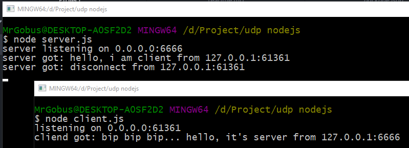

# UDP / Datagram сокеты в node.js



Начитался статей на тему создания игровых серверов в которых утверждается, что UDP это единственно верный выбор между UDP и TCP протоколами передачи данных по сети. По этой причине решил разобраться в теме UDP на node.js.

Официальная документация: [UDP / Datagram Sockets](https://nodejs.org/api/dgram.html#dgram_socket_send_msg_offset_length_port_address_callback)

ВНИМАНИЕ! Информация ниже может содержать неверные данные связанные с моим недопониманием вопроса, так как является результатом научно-технического поиска. Буду рад обсудить уточнения и внести правки в статью.

Главным достоинством UDP является скорость. У скорости есть цена.

* UDP не гарантирует порядок получения пакетов.
* UDP не гарантирует получение пакета.

Единственное, что гарантирует UDP, это целостность пакета размер которого может достигать 65507 байт.

Еще один важный недостаток - WEB браузеры не имеют поддержки UDP по причинам безопасности и тому, что браузер работает через TCP.

В UDP нет понятия специализированного сокета для клиента и сервера. И там и там используется один тип сокета, который слушает заданный порт. Полученный пакет имеет информацию о IP и порте отправителя, благодаря чему приложение может определиться куда отсылать ответ.

# Сервер

Пример простого сервера. Висит на порту 6666 и если получает любое сообщение в ответ посылает пакет содержащий строку "bip bip bip... hello, it's server" В качестве IP адреса использует 0.0.0.0, что означает любой IP используемый компьютером, в том числе 127.0.0.1.

После вызова команды bind выполнения скрипта продолжится но не завершиться. Программа будет оставаться в память до момента вызова socket.close() либо принудительной остановки скрипта (ctrl+z, ctrl+c, kill ...)

```javascript
const dgram = require("dgram")

class Server {

	constructor(param) {

		this.socket = dgram.createSocket("udp4")

		this.socket.on("error", (error)=>{
			console.log(`server error:\m${err.stack}`)
		})

		this.socket.on("message", (msg, rinfo)=>{
			console.log(`server got: ${msg} from ${rinfo.address}:${rinfo.port}`)
			this.socket.send(Buffer.from("bip bip bip... hello, it's server"), rinfo.port, rinfo.address)
		})

		this.socket.on("listening", ()=>{
			const address = this.socket.address()
			console.log(`server listening on ${address.address}:${address.port}`)
		})

		this.socket.bind(param.port, param.address)
	}

}

let server = new Server({
	address: "0.0.0.0",
	port: 6666
})
```

# Клиент

Работа клиента схожа с работой сервера, сокет после первого вызова команды send переходит в режим прослушивания порта, и также как после bind позволит завершиться программе только после вызова close. Первый вызов send забиндит сокет клиента на свободный IP и порт, что эквивалентно вызову bind перед send без параметров. Если вызвать bind с параметрами, то сокет забиндится на указанный IP и порт.

Библиотека dgram асинхронная. Большинство методов (bind, send, close ...) имеют параметр callback который вызывается при завершении операции, что позволяет хоть как то контролировать порядок выполнения и отправки. Например, если вызвать close сразу после send, то отправленные данные не успеют отправиться до закрытия сокета. 

```javascript
const dgram = require("dgram")

class Client {

	constructor(param) {

		this.address = param.address
		this.port = param.port

		this.socket = dgram.createSocket("udp4")

		this.socket.on("message", (msg, rinfo)=>{
			console.log(`client got: ${msg} from ${rinfo.address}:${rinfo.port}`)
			client.close()
		})

		this.socket.on("listening", ()=>{
			const address = this.socket.address()
			console.log(`listening on ${address.address}:${address.port}`)
		})

	}

	say(msg, callback) {
		this.socket.send(Buffer.from(msg), this.port, this.address, callback)
	}

	close(callback) {
		this.socket.send(Buffer.from("disconnect"), this.port, this.address, ()=>{
			this.socket.close(callback)
		})
	}

}

let client = new Client({
	address: "127.0.0.1",
	port: 6666
})

client.say("hello, i am client")
```
